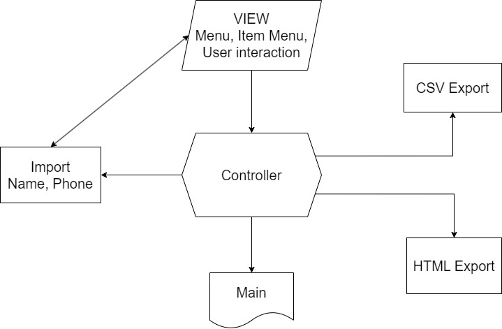

# **Создать телефонный справочник с возможностью импорта и экспорта данных в нескольких форматах.**

## **Декомпозиция на модули:**

1. **View - модуль вмещающий в себя логику общего меню и взаимодействия с пользователем.**

Содержит функции:
+ def InterfaceMenu - Вызов меню. Уведомляет пользователя о возможностях программы.
+ def Item - Выбор пункта. Уведомляет пользователя о возможности выбора одного из пунктов меню.
+ def Record - Запись новых данных в Телефонный справочник. Запрашивает у пользователя новые ФИО и Телефон.

2. **Record - модуль вмещающий в себя логику записи новых данных в телефонную книгу формата ".txt".**

Содержит функцию:
+ def NewRecord - помещает новые данные в файл "Phonebook.txt"

3. **HtmlFormat - модуль вмещающий в себя логику считывания данных, из файла формата ".txt" и их экспортирования в файл формата ".html".**

Содержит функцию:
+ def GoToHtml - помещает данные в файл "Phonebook.html"

4. **CsvFormat - модуль вмещающий в себя логику считывания данных, из файла формата ".txt" и их экспортирования в файл формата ".csv".**

Содержит функцию:
+ def GoToCsv - помещает данные в файл "Phonebook.csv"

5. **Controller - связующий модуль, импортирует модули: Record, HtmlFormat, CsvFormat и View.**

Содержит функции:
+ def CallMenu - активация меню.
+ def ItemMenu - активация пункта меню.
+ def ChoiceItem - активация условий пунктов меню.

6. **Main - импортирует модуль Controller и вызывает сопутствующие функции: CallMenu, ItemMenu и ChoiceItem**.

## **Блок - схема:**

## **Результаты:**

+ Результаты выполнения первого пункта дополняет содежрание файла Phonebook.txt новыми данными с новой строки.
+ Результаты выполнения второго пункта создает новый файл Phonebook.html на основании содежрания файла Phonebook.txt.
+ Результаты выполнения третьего пункта создает новый файл Phonebook.csv на основании содежрания файла Phonebook.txt.