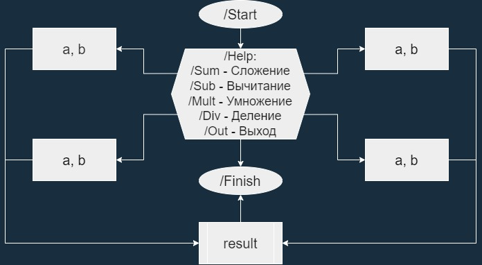

# Создать бот-телеграмм - калькулятор, организовать меню, для работы с рациональными числами. (за основу взята идея из Seminar7)

### I. **“Архитектура” для работы бот-телеграмма:**

### II. **Структура бот-телеграмма:**

1. Функция def get_text_messages - содержит меню из команд:

* "/Start" - запуск и информация о боте
* "/Help" - справка о функциях
* "/1_Sum" - функция сложения
* "/2_Sub" - функция вычитания
* "/3_Mult" - функция умножения
* "/4_Div" - функция деления
* "/5_Out" - выход из меню

2. Функции def sum1 и sum2 - содержат запросы о первом и втором числе для ввода пользователем и результат сложения.

3. Функции def sub1 и sub2 - содержат запросы о первом и втором числе для ввода пользователем и результат вычитания.

5. Функции def mult1 и mult2 - содержат запросы о первом и втором числе для ввода пользователем и результат умножения.

6. Функции def div1 и div2 - содержат запросы о первом и втором числе для ввода пользователем и результат деления.