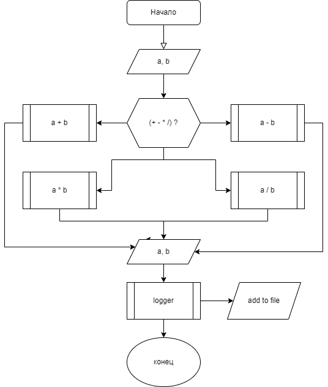

## Создать калькулятор для работы с рациональными числами, с системой логирования.

### I. **“Архитектура” для работы данного приложения:**

### II. **Модули:**

1. **Interface модуль - принимает на вход два числа от пользователя, анализирует и возвращает, что это рациональное число, или, в противном случае, выдает ошибку.**

*Взаимодействует с модулем **Main***

2. **Sub модуль - выполняет арифметическую операцию "Вычитания", двух введеных ранее чисел пользователем.**

3. **Sum модуль - выполняет арифметическую операцию "Сложения", двух введеных ранее чисел пользователем.**

4. **Mult модуль - выполняет арифметическую операцию "Умножения", двух введеных ранее чисел пользователем.**

5. **Div модуль - выполняет арифметическую операцию "Деления", двух введеных ранее чисел пользователем.**

*Модули 2, 3, 4, и 5 - Взаимодействуют с модулем **Operators***

6. **Operators модуль - предоставляет пользователю выбор из 4-х действий (Вычитания, Сложения, Умножения или Деления) и в соответствии с выбранным действием показывает пользователю результат. Также записывает результат в отдельный файл logger.**

*Взаимодействует с модулями **Sub, Sum, Mult, Div и Logger***

7. **Logger модуль - формирует запись о дате и результате действий с числами, в соответствии с выбором пользователя, в отдельный файл "Log" формата "CSV".**

*Взаимодействует с модулем **Operators***

8. **Main модуль - запуск программы.**

*Взаимодействует с модулями **Operators и Interface***